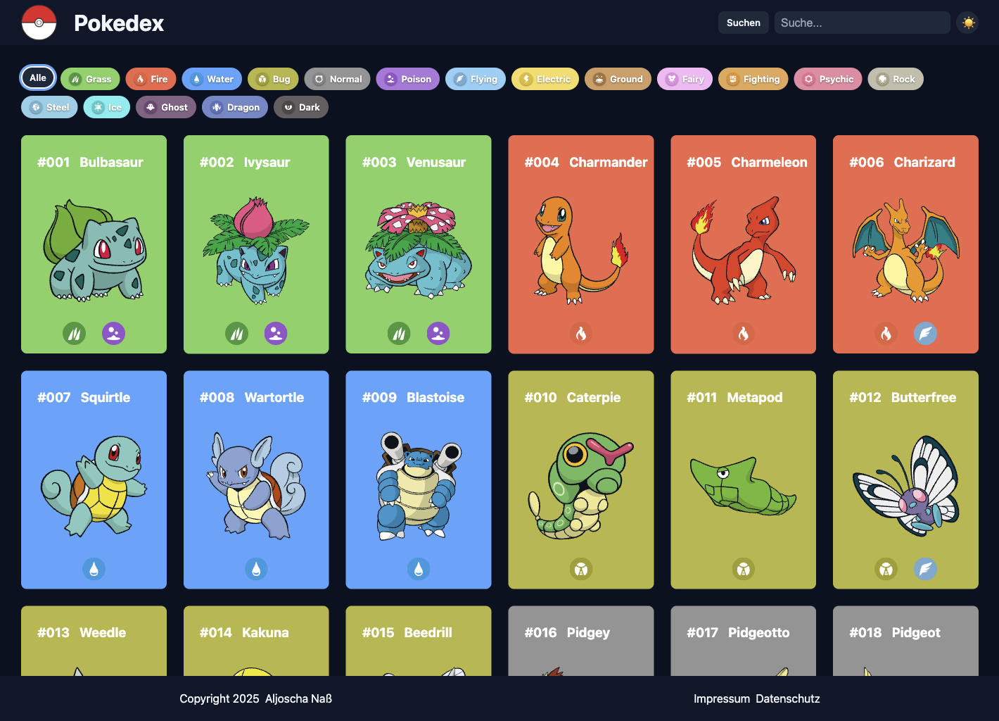

> 🇬🇧 English version: [README.en.md](README.en.md)

# Pokedex

Eine Vanilla-JS-Web-App, die die [PokéAPI](https://pokeapi.co) anzapft und die ersten Generationen von Pokémon übersichtlich, durchsuchbar und filterbar präsentiert. Kein Build-Tool, keine npm-Dependencies — einfach öffnen und loslegen.



## Features

- **Live-Liste** mit Pagination ("Mehr Laden") — 21 Pokémon pro Batch
- **Suche** ab 3 Zeichen mit visueller Fehleranzeige
- **Typ-Filter** mit Mehrfachauswahl (alle 18 Typen) und "Alle"-Reset
- **Detail-Overlay** mit vier Tabs:
  - *About* — Spezies, Größe, Gewicht, Fähigkeiten, Brut-Infos
  - *Base Stats* — animierte Balken pro Stat + Total
  - *Evolution* — komplette Entwicklungskette mit Sprites
  - *Moves* — die ersten 8 Moves
- **Dark Mode** mit Toggle, gespeichert in `localStorage`, respektiert `prefers-color-scheme`
- **Tastatur-Navigation:**
  - `Tab` / `Enter` — Cards öffnen
  - `Esc` — Overlay schließen
  - `←` / `→` — vorheriges / nächstes Pokémon im Overlay
- **LocalStorage-Caching** mit 7-Tage-TTL — Liste, Spezies-Daten und Evolution-Chains werden zwischengespeichert
- **Offline-Support** über Service Worker (statische Assets + cached API-Antworten)
- **DSGVO-konformes Impressum + Datenschutz**

## Tech-Stack

- **HTML5**, **CSS3** (Custom Properties, Grid, Flexbox, mobile-first Responsive)
- **Vanilla JavaScript** — keine Frameworks, keine Bundler, keine Dependencies
- **[PokéAPI v2](https://pokeapi.co/docs/v2)** als Datenquelle
- **Service Worker** für Offline-Fähigkeit

## Lokal starten

Da der Service Worker und die `fetch`-Aufrufe an die PokéAPI nicht über `file://` funktionieren, brauchst du einen lokalen HTTP-Server.

**Option 1 — VS Code Live Server:**
1. Extension [Live Server](https://marketplace.visualstudio.com/items?itemName=ritwickdey.LiveServer) installieren
2. Rechtsklick auf `index.html` → "Open with Live Server"

**Option 2 — Python:**
```bash
python3 -m http.server 8000
```
Dann [http://localhost:8000](http://localhost:8000) im Browser öffnen.

**Option 3 — Node:**
```bash
npx serve .
```

## Projektstruktur

```
pokedex/
├── index.html              Einstiegspunkt
├── style.css               Layout, Header, Cards, Grid
├── styles/
│   ├── theme.css           Light/Dark-Mode CSS-Variablen
│   ├── standard.css        Reset + globale Utilities
│   ├── overlay.css         Detail-Modal
│   └── color.css           Pokémon-Typ-Farben (18 Typen)
├── scripts/
│   ├── state.js            Globaler State + Konstanten
│   ├── storage.js          LocalStorage-Wrapper mit TTL
│   ├── api.js              PokéAPI-Aufrufe
│   ├── templates.js        HTML-Templates (Cards, Overlay, Stats…)
│   ├── render.js           DOM-Rendering, Filter-Logik, Theme
│   ├── events.js           Event-Delegation, Keyboard-Navigation
│   └── main.js             Initialisierung, Service-Worker-Registrierung
├── html/
│   ├── impressum.html
│   └── datenschutz.html
├── assets/
│   ├── img/                Logo, Favicon
│   ├── icons/              SVG-Icons für alle 18 Typen
│   └── screenshots/        Vorschau-Bilder fürs README
├── sw.js                   Service Worker
└── LICENSE
```

## Architektur

Bewusst klassisch gehalten: globale Funktionen + ein geteiltes `state`-Objekt — **keine** ES-Modules, keine Klassen-Hierarchien. Die Module sind über die `<script>`-Reihenfolge in [index.html](index.html) verkettet:

```
state → storage → api → templates → render → events → main
```

Render-Logik ist deklarativ — `applyFilters()` baut den sichtbaren ID-Pool, `renderGrid()` mappt das auf HTML. Event-Delegation auf den jeweiligen Containern hält die Listener-Anzahl konstant, egal wie viele Pokémon geladen sind.

## Accessibility

- Semantische Buttons für alle interaktiven Elemente
- `aria-label`, `aria-modal`, `aria-pressed`, `role="dialog"` / `role="group"`
- Sichtbare `:focus-visible`-Outline in beiden Themes
- Volle Tastatur-Navigation (Tab, Enter, Pfeiltasten, Escape)
- Reduced-Motion-freundliche Transitions

## Datenquelle

Alle Pokémon-Daten stammen von der [PokéAPI](https://pokeapi.co). Sprites werden direkt aus dem [PokéAPI-Sprites-Repo](https://github.com/PokeAPI/sprites) geladen.

## Lizenz

[MIT](LICENSE) © Aljoscha Naß
